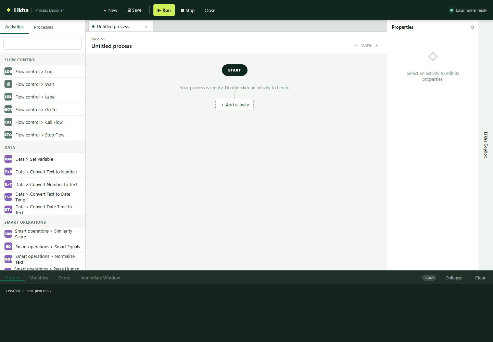
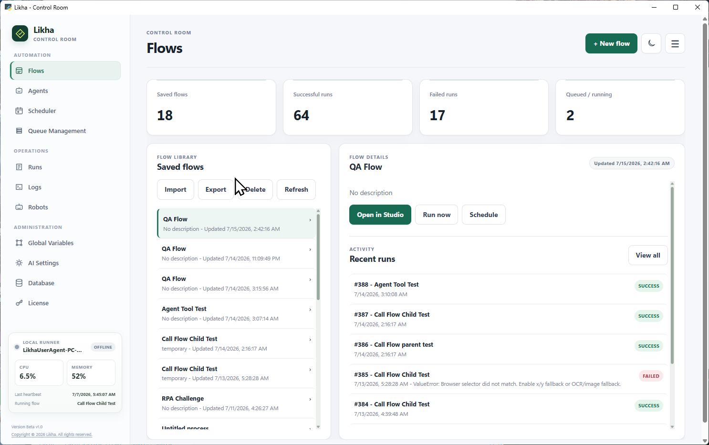
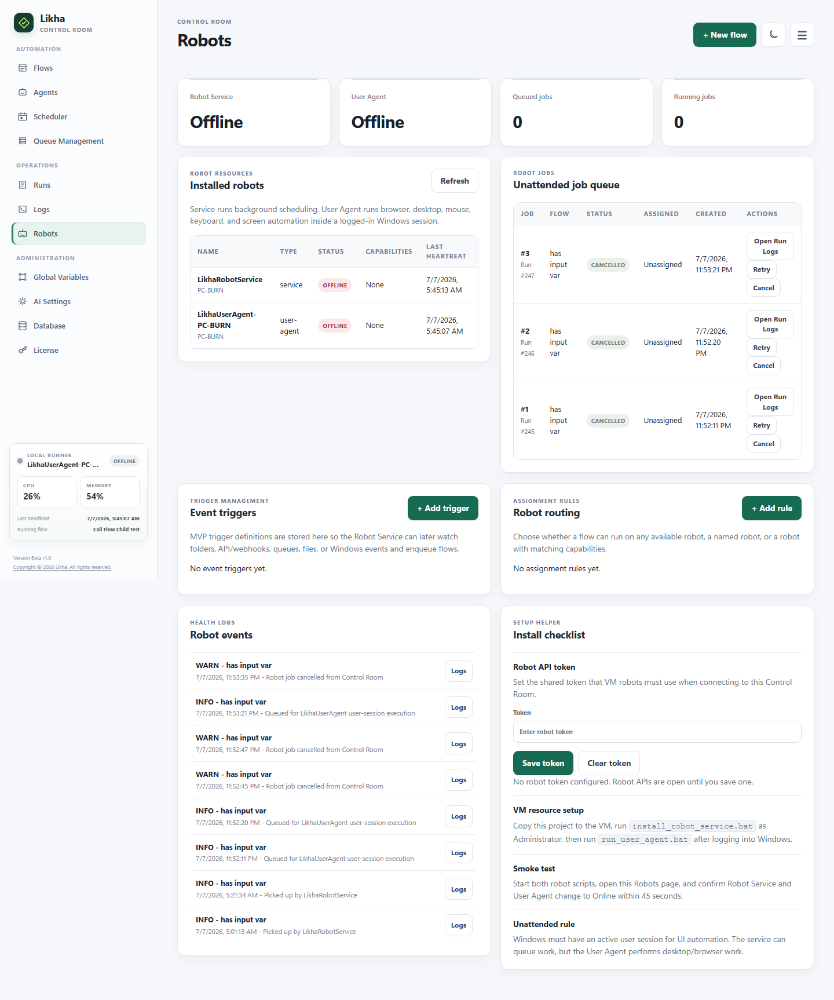
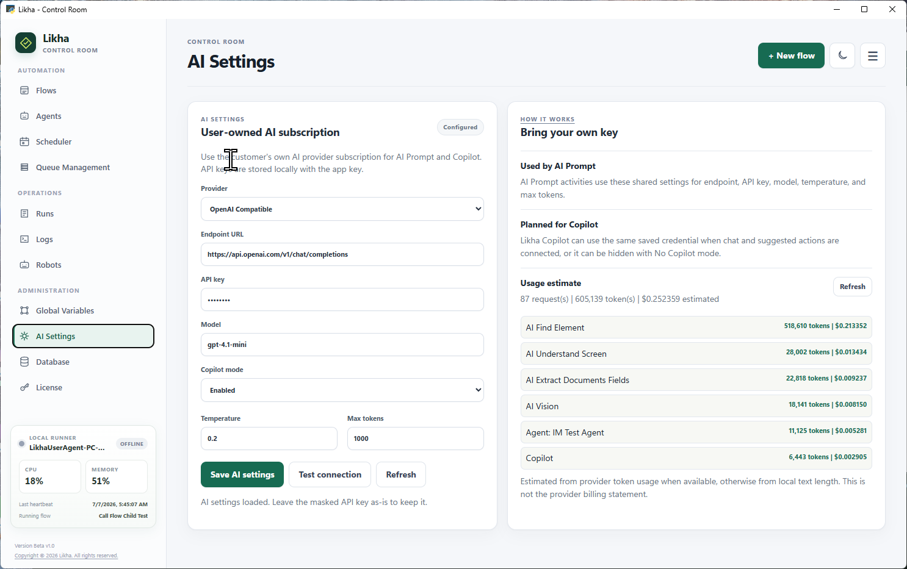

# Likha Agentic Process Automation

Likha is a Windows-first Agentic Process Automation platform, also called Agentic RPA, for building, running, and managing governed AI agents and reliable workflows across desktop apps, browsers, Excel, files, queues, APIs, scripts, and AI-powered tasks.

It is designed for teams that want practical automation without being forced into a large enterprise platform before they are ready.
 
## Download

Download link placeholder:

[Download Likha Installer](https://github.com/BurnIMJerome/LIKHA-_-BETA/tree/main/docs/installer-output)

Beta Version Release Note:  FOR LICENSE KEY Request - Send me an email at Jearomev@yahoo.com 

## What Likha Does

Likha helps users automate outcomes by combining goal-driven AI agents with a low-code Process Designer, Control Room, and robot runtime. Agents can understand context and choose approved tools, while RPA workflows provide reliable execution for repeatable business actions.

Core capabilities:

- Build versioned agents with knowledge bases, citations, session memory, approved flow tools, and specialist-agent delegation.
- Apply deterministic agent guardrails, flow risk levels, per-message approvals, secret redaction, and destination restrictions.
- Test agents in the playground and publish locally embedded chat experiences.
- Build flows visually in Process Designer.
- Run flows interactively during development.
- Schedule unattended runs.
- Process queue items.
- Monitor run logs and robot jobs.
- Use AI Capabilities for prompts, document extraction, vision, table extraction, and knowledge search.
- Use AI Screen Control to understand, find, click, type into, read, verify, and extract specific details from visible application screens.
- Use Smart Operations for local fuzzy matching, parsing, normalization, and extraction.
- Use System activities to manage processes, run batch files, and inspect the robot machine and user.
- Automate Windows desktop applications.
- Automate modern browsers.
- Read and write Excel workbooks.
- Work with files, folders, APIs, scripts, and data tables.
- Connect AI providers through Control Room AI Settings.
- Choose SQLite, PostgreSQL/Supabase, or Microsoft SQL Server from Control Room Database settings.
- Run robots on local machines or separate VM resources.

## Product Highlights

### Agents

Build goal-driven automations with grounded knowledge, citations, version history, typed flow tools, supervisor-to-specialist delegation, guardrails, a test playground, and local website embedding.

Start here:

[Agentic AI and Likha Agents](docs/21%20-%20Agents.md)

### Agent Infrastructure

Run agents through Likha's Control Room, workflow engine, selectable database, queues, robot services, active Windows user sessions, AI settings, audit events, and operational logs across local or private VM environments.

Start here:

[Agent Infrastructure](docs/22%20-%20Agent%20Infrastructure.md)

### Desktop Automation

Automate Windows applications using selectors, OCR/image fallback, hotkeys, screenshots, text extraction, table extraction, and hardware input when needed.

Start here:

[Desktop Automation](docs/08%20-%20Desktop%20Automation.md)

### Browser Automation

Automate websites using BrowserInstance variables, selector picking, highlighting, clicks, filling, screenshots, table extraction, OCR/image matching, and JavaScript execution.

Start here:

[Browser Automation](docs/09%20-%20Browser%20Automation.md)

### Excel Automation

Launch Excel, read ranges, write ranges, read and write cells, execute macros, get worksheet names, and inspect last used rows and columns.

Start here:

[Excel Automation](docs/11%20-%20Excel%20Automation.md)

### Control Room

Use the redesigned Control Room to manage agents, knowledge, flows, schedules, runs, logs, global variables, queues, robots, AI settings, database settings, and licensing. It includes grouped navigation, light/dark themes, and Local Runner CPU, memory, heartbeat, and current-flow status.

Start here:

[Quick Start](docs/07%20-%20Quick%20Start.md)

### Database Options

Use SQLite automatically for local installations, or configure PostgreSQL/Supabase or Microsoft SQL Server for shared deployments. Test the connection before saving; the selection takes effect after restart.

Start here:

[Database Settings](docs/Database%20Settings.md)

### Unattended Robots

Run scheduled and triggered jobs through `LikhaRobotService` and `LikhaUserAgent`, including distributed VM robot setups.

Start here:

[Orchestrator](docs/17%20-%20Orchestrator.md)

### AI Integration

Bring your own AI provider and configure it in Control Room. Likha provides workflow activities for prompting, document field extraction, vision, table extraction, and knowledge search without forcing a separate AI platform subscription.

Start here:

[AI Integration](docs/10%20-%20AI%20Integration.md)

## Advantages

## Start Small

Likha can run as a local desktop automation studio. A user can install it, build a flow, and run it on one machine without needing a server or enterprise orchestrator.

## Scale When Needed

When the automation program grows, Likha can expand into schedules, queues, Control Room, robot jobs, and VM robots.

## Own The Runtime

Likha is designed for teams that want control over where automation runs: local machine, on-premise server, VM robot, or private infrastructure.

## Bring Your Own AI

Likha connects to the AI provider configured by the user. The platform does not need to sit between the user and the provider as a markup layer.

## Practical Activity Coverage

Likha focuses on the activities automation builders use every day:

- Browser
- Desktop
- Excel
- Files
- Queues
- APIs
- Scripts
- Data tables
- Flow control
- Mouse and keyboard
- Monitor
- Message boxes
- AI
- Event triggers

## Product Vision

Likha's vision is to make Agentic Process Automation accessible, practical, governable, and owned by the people who build it.

The product direction is:

- Keep the designer approachable.
- Keep activity behavior clear and predictable.
- Support real-world Windows automation.
- Let teams start locally and scale gradually.
- Keep orchestration optional until it is needed.
- Support private infrastructure and distributed robot setups.
- Let users choose their AI provider.
- Combine adaptive agent decisions with predictable workflow execution.
- Keep agents bounded by approved tools, credentials, limits, and human approval rules.
- Build a product that small teams can afford and developers can enjoy using.

## Documentation Map

- [01 - Founder's Manifesto](docs/01%20-%20Dev's%20Manifesto.md)
- [02 - Product Overview](docs/02%20-%20Product%20Overview.md)
- [03 - Why Likha](docs/03%20-%20Why%20Likha.md)
- [04 - Architecture](docs/04%20-%20Architecture.md)
- [05 - Features](docs/05%20-%20Features.md)
- [06 - Installation Guide](docs/06%20-%20Installation%20Guide.md)
- [07 - Quick Start](docs/07%20-%20Quick%20Start.md)
- [08 - Desktop Automation](docs/08%20-%20Desktop%20Automation.md)
- [09 - Browser Automation](docs/09%20-%20Browser%20Automation.md)
- [10 - AI Integration](docs/10%20-%20AI%20Integration.md)
- [11 - Excel Automation](docs/11%20-%20Excel%20Automation.md)
- [12 - Data and Data Table Activities](docs/12%20-%20Data%20and%20Data%20Table%20Activities.md)
- [13 - Flow Control and Loops](docs/13%20-%20Flow%20Control%20and%20Loops.md)
- [14 - Input, Monitor, and Message Activities](docs/14%20-%20Input,%20Monitor,%20and%20Message%20Activities.md)
- [15 - Files, Queues, API, and Scripting](docs/15%20-%20Files,%20Queues,%20API,%20and%20Scripting.md)
- [16 - Event Triggers](docs/16%20-%20Event%20Triggers.md)
- [17 - Orchestrator](docs/17%20-%20Orchestrator.md)
- [18 - Licensing](docs/18%20-%20Licensing.md)
- [19 - Roadmap](docs/19%20-%20Roadmap.md)
- [20 - FAQ](docs/20%20-%20FAQ.md)
- [21 - Agentic AI and Likha Agents](docs/21%20-%20Agents.md)
- [22 - Agent Infrastructure](docs/22%20-%20Agent%20Infrastructure.md)
- [Database Settings](docs/Database%20Settings.md)
- [AI Screen Control Activities](docs/Activities/AI%20Screen%20Control/README.md)
- [System Activities](docs/Activities/System/README.md)

Grouped activity documentation:

[Activities](docs/Activities/README.md)

Image repository:

[images](docs/images/README.md)

## Release Notes

### Current MVP

This documentation set describes the current MVP state of Likha.

Included areas:

- Process Designer
- Control Room
- Desktop automation
- Browser automation
- Excel automation
- Queue Management
- Scheduler
- Robot service and user agent
- Event triggers
- Agents and agent infrastructure
- Agent knowledge bases, flow tools, specialist delegation, guardrails, playground, and local embedding
- SQLite, PostgreSQL/Supabase, and Microsoft SQL Server database selection
- AI settings, AI Prompt, AI Vision, document extraction, table extraction, and knowledge search
- AI Screen Control extraction through AI Extract Details From
- Data Table activities
- Flow control and loop activities
- File, API, scripting, monitor, message, and keyboard/mouse activities

Recent improvements documented in this build:

- Added the Agent Builder with knowledge ingestion, citations, versioning, typed flow tools, session memory, playground testing, and local embed publishing.
- Added bounded supervisor-to-specialist agent delegation with separate child sessions, trace storage, cycle prevention, and inherited approval enforcement.
- Added agent guardrails for prompt injection, sensitive data, rate and length limits, allowed destinations, High-risk approvals, Critical-risk blocking, and audit events.
- Added selectable SQLite, PostgreSQL/Supabase, and Microsoft SQL Server databases with connection testing and locally encrypted saved credentials.
- Added AI Extract Details From with variable-aware extraction instructions, structured Object output, status code, and `null` for missing requested values.
- Redesigned Control Room navigation, added persistent light/dark themes, and added Local Runner CPU, memory, heartbeat, and current-flow status.
- Refreshed Process Designer styling and added persistent theme selection plus resizable Activities, Properties, and Output panels.
- Designer runs are separated from unattended robot queueing.
- Desktop Click OCR/image fallback is scoped and prioritized when selected.
- Browser selector picking prefers stable attributes such as `name` when IDs are dynamic.
- Send Keys resolves workflow expressions such as `current_row["First Name"]`.
- Excel Read Range normalizes blank cells and removes empty rows/trailing columns.
- Activity documentation is grouped under `Documentation/Activities`.

### Upcoming

Planned documentation and product areas:

- Final licensing details
- Installer download link
- More complete robot assignment rules
- Artifact upload and screenshot collection from robot runs
- Production database setup
- Security hardening guide
- Role-based access and administration guide

## Useful Starting Points

New users:

[Quick Start](docs/07%20-%20Quick%20Start.md)

Builders:

[Activities](docs/Activities/README.md)

Administrators:

[Architecture](docs/04%20-%20Architecture.md)

Robot VM setup:

[Distributed Control Room and VM Robot Setup](docs/Distributed%20Control%20Room%20and%20VM%20Robot%20Setup.md)
